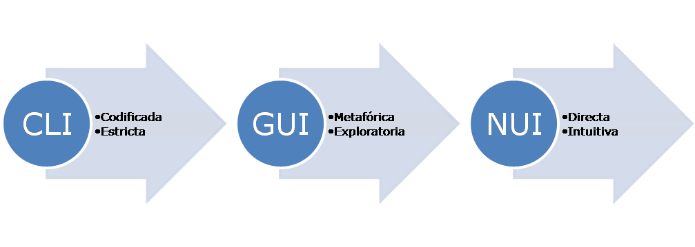

- https://clig.dev/#philosophy
- https://es.wikipedia.org/wiki/Interfaz_de_l%C3%ADnea_de_comandos
- https://es.wikipedia.org/wiki/Interfaz_natural_de_usuario
- https://wiki.archlinux.org/title/Linux_console_(Espa%C3%B1ol)

***

#### La interfaz de línea de comandos (CLI)  

Es un tipo de interfaz de usuario de computadora que permite a los usuarios dar instrucciones a algún programa informático o al sistema operativo por medio de una línea de texto simple. Debe notarse que los conceptos de **CLI, shell y emulador de terminal** no son lo mismo ya que **CLI** se refiere al paradigma, mientras que un shell o un emulador de terminal son programas informáticos específicos, que usualmente en conjunto implementan la **CLI**. (**wikipedia**).

La contraparte de **CLI** es la interfaz gráfica de usuario (**GUI**) que ofrece una estética mejorada y una mayor simplificación, a costa de un mayor consumo de recursos computacionales, y, en general, de una reducción de la funcionalidad alcanzable. Asimismo aparece el problema de una **mayor vulnerabilidad** dada su complejidad. (Trabajar sobre esta suele ser mucho mas lento.)

Las CLI son usadas por muchos programadores y administradores de sistemas como herramienta primaria de trabajo, especialmente en sistemas operativos basados en Unix; en entornos científicos y de ingeniería, y un subconjunto más pequeño de usuarios domésticos avanzados. (Aqui hablan de nosotros <3).

Las Interfaz natural de usuario (**NUI**), no lo comento aqui, pero arriba he dejado la referencia por si quieren saber que es.

 

### Linux console

Es una consola del sistema interno del kernel de Linux. La consola de Linux proporciona una manera para que el kernel y otros procesos envíen resultados de texto al usuario y reciban entradas de texto del usuario. El usuario generalmente ingresa texto con un teclado de ordenador y lee el texto de salida en un monitor de ordenador. El kernel de Linux admite consolas virtuales, esto es consolas que están lógicamente separadas, pero que acceden al mismo teclado y pantalla físicos. (**wiki archlinux**).

#### Implementación

La **consola**, a diferencia de la mayoría de los servicios que interactúan directamente con los usuarios, se implementa en el **kernel**. Esto contrasta con el software de **emulación de terminal**, como **LXterminal**, **xfce4-terminal**, etc ... que se implementa en el **espacio del usuario** como una aplicación normal.

#### Virtual consoles

La consola se presenta al usuario como una serie de consolas virtuales. Estas dan la impresión de que varios terminales independientes se ejecutan simultáneamente. Cada consola virtual puede iniciar sesión con diferentes usuarios, ejecutar su propio intérprete de comandos y tener su propia configuración de tipografía. Cada una de las consolas virtuales utiliza un dispositivo **/dev/ttyX**, y se puede alternar entre ellas presionando **Ctrl+Alt+Fx** (donde x es igual al número de la consola virtual, comenzando con 1). El dispositivo **/dev/console** se asigna automáticamente a la consola virtual activa.

#### La shell :3

Es un intérprete de línea de comandos que proporciona una interfaz de usuario para el sistema operativo Unix y para sistemas similares a Unix (ejemplo GNU/Linux) . Los usuarios dirigen el funcionamiento de la computadora introduciendo comandos como texto y el intérprete de línea de comandos los ejecuta o pueden crear scripts de texto de uno o más órdenes de este tipo.

#### Emulator de terminal 

Un emulator de terminal permite a un usuario interactuar con un intérprete de comandos (**shell**) desde  **Xorg** (Xorg se estudiara mas adelante).
